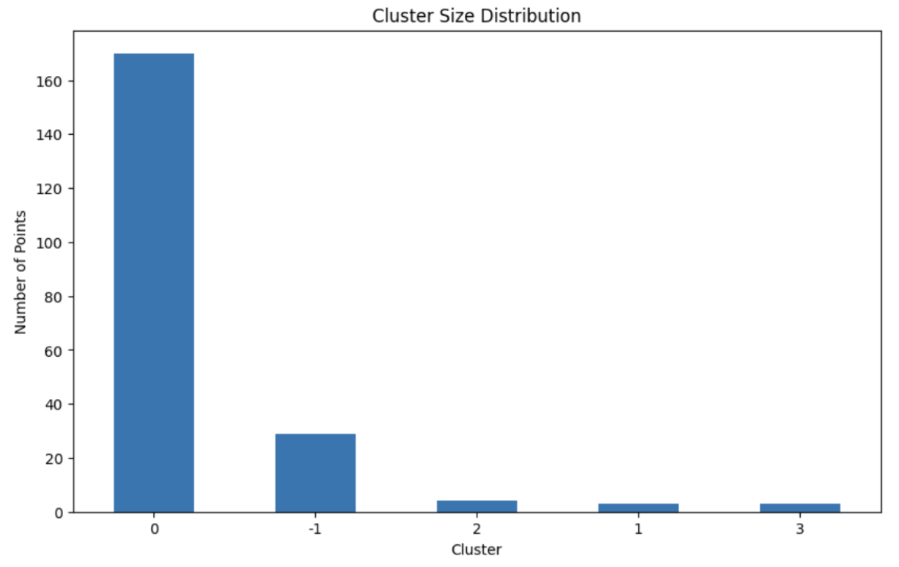
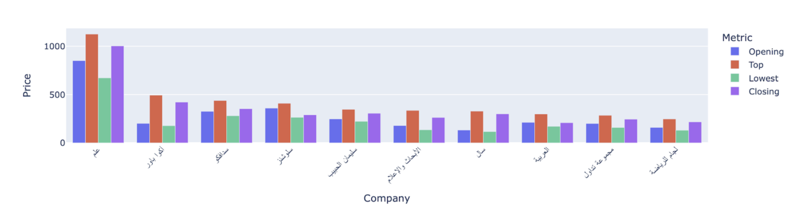
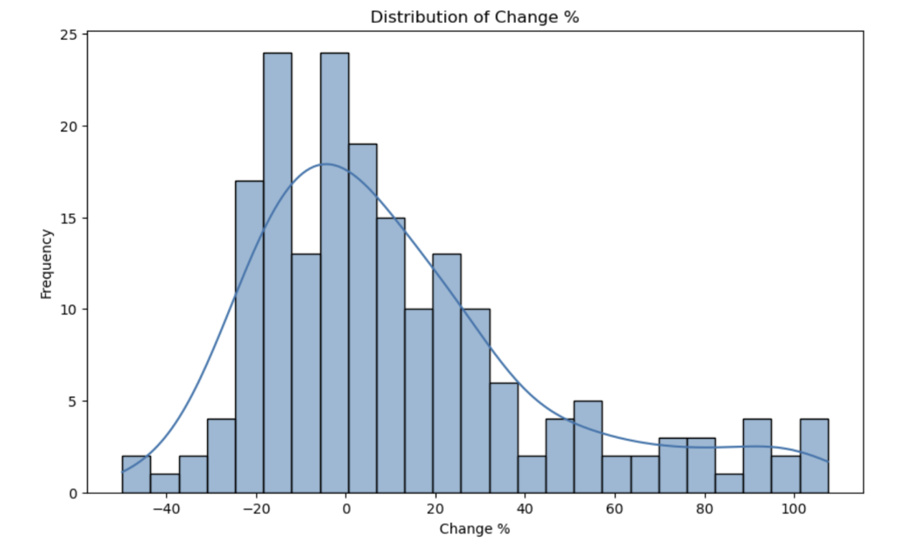
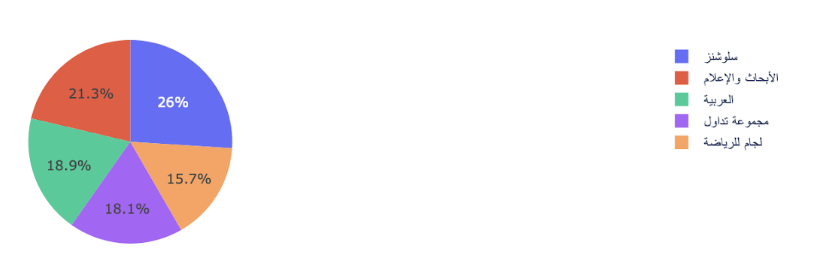
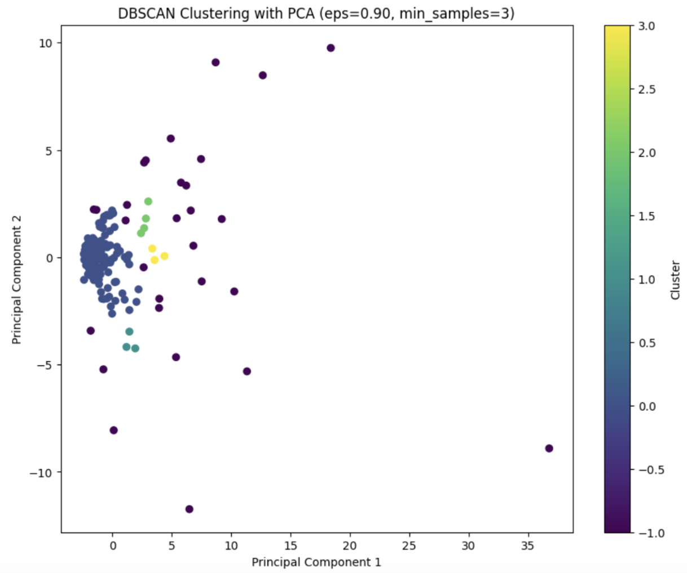
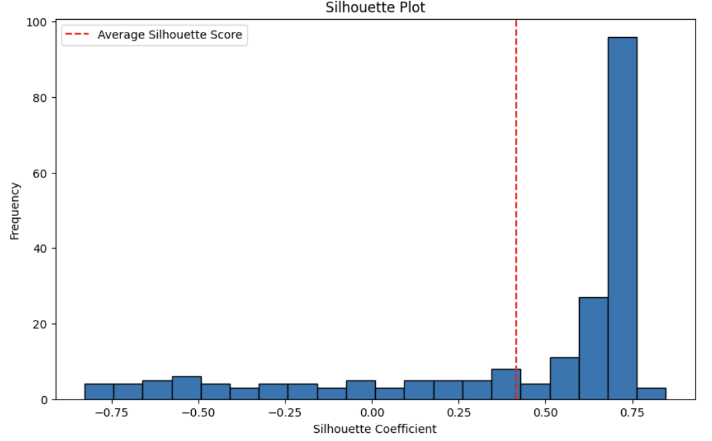
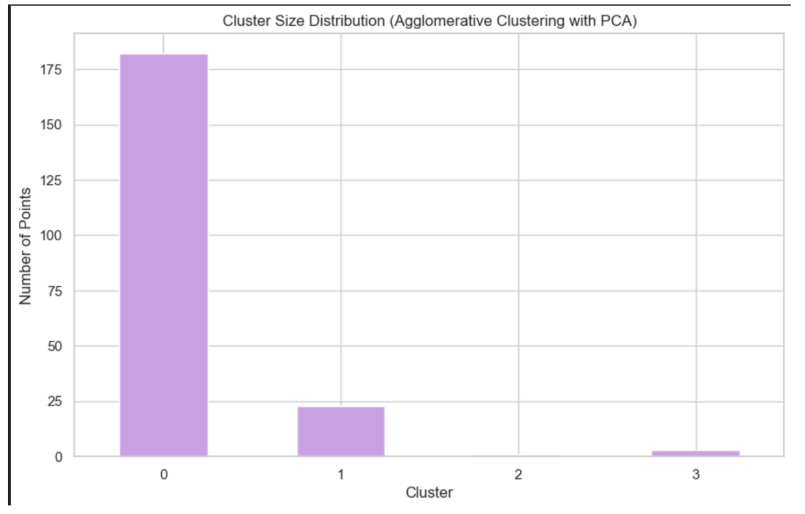

# Usecase-8-Project-5

# Stock data clustering project 

### Team Members: 
- Dania Alshehri
- Sarraa Almudayfir 
- Ashwag Almalki 
- Musa Alubaid
- Naif  Ghannam

### Introduction: 
Briefly describe the problem being addressed and the goals of the project. 
This project focused on analyzing and clustering Saudi stock market companies based on their trading metrics. The main objective was to identify groups of companies with similar trading behaviors through the application of unsupervised machine learning techniques. The resulting insights can assist investors and analysts in recognizing patterns and making well-informed decisions. 

### Dataset Synopsis and Origin: 
The dataset comprises stock trading data for various companies, including features like `Opening`, `Top`, `Lowest`, `Closing`, `Change`, `Change %`, `Traded Quantity`, and `Trading value (SAR)`. The dataset was sourced from “Saudi Tadawul” (conducts listing and trading in securities for local and international investors. The Exchange is instrumental to achieving the long-term growth plans for the Group and providing market participants with attractive and diversified investment opportunities.)
Home (saudiexchange.sa)

The dataset after scraping
Tadawul (kaggle.com)

### Data visualization: 

Alam is the highest priced company, as it started with the highest opening at 850 and closed at 1002.

Most of the change was within 20% profit or loss, and the positive change was more than the negative change and reached 100%.

This chart shows the highest stock values for 5 companies. 

(p4)
Saudi Aramco dominates with over 2 billion SAR in trading value, highlighting its market leadership, while the banking sector also shows significant investor interest, with Al Rajhi Bank and Al Ahli Bank both exceeding 1 billion SAR.

### Model Selection:
- DBSCAN
- Agglomerative Clustering
- Principal Component Analysis (PCA)

### Feature Engineering:
- Relevant Numerical selection: Selected relevant numerical columns for clustering: `Opening`, `Top`, `Lowest`, `Closing`, `Change`, and `Change %`. 
- Scaling : Applied RobustScaler to reduce the influence of outliers, followed by PCA to reduce the dimensionality to three principal components.
- PCA Transformation: Reduced the dataset to its three most significant principal components, which captured the majority of variance in the data.

### Hyperparameter Optimization:
- In BDSCAN:
Epsilon: set to 3
Minimum Samples: set to  0.9

- In agglomerative Clustering: 
Number of Clusters: Set to 4 clusters.
Linkage Method: Used `ward` linkage, which minimizes the variance within each cluster.

### Performance Metric Visuals:
- In BDSCAN:
Silhouette Score: 0.415
Davies-Bouldin Index (DBI): 1.978
Cluster Size Distribution:

- In agglomerative Clustering:
Silhouette Score: 0.621 
Davies-Bouldin Index (DBI): 0.576
Cluster Size Distribution:

Dendrogram for agglomerative mode:

### Best Model Determination:
The agglomerative Clustering model was selected as the best-performing model based on the lowest Davies-Bouldin Index (0.576) and the highest Silhouette Score (0.621). This model demonstrated the most distinct and well-separated clusters.

### Feature and Prediction Insights:
- PC1 (Primarily influenced by Closing, Change, and Lowest prices): Positively correlated with overall stock performance.

- PC2 (Primarily influenced by Change % and Change): Highlights the volatility and percentage changes in stock prices.

- PC3 (Primarily influenced by Change %): Captures the rate of change in stock performance.

Cluster Characteristics: The clusters formed through Agglomerative Clustering exhibited distinct financial profiles:

- Cluster 0: Comprised companies with relatively higher Opening and Closing prices, suggesting a group of potentially stable or high-performing companies.
- Cluster 1: Included companies with lower average prices across financial metrics, potentially indicating lower market valuation or performance.
- Cluster 2: A smaller cluster that consisted of outliers with extremely high values in one or more financial metrics, possibly identifying market leaders or companies with unique circumstances influencing their stock prices.
- Cluster 3: Contained companies with moderate prices and changes, potentially representing a middle ground in the market.

  

